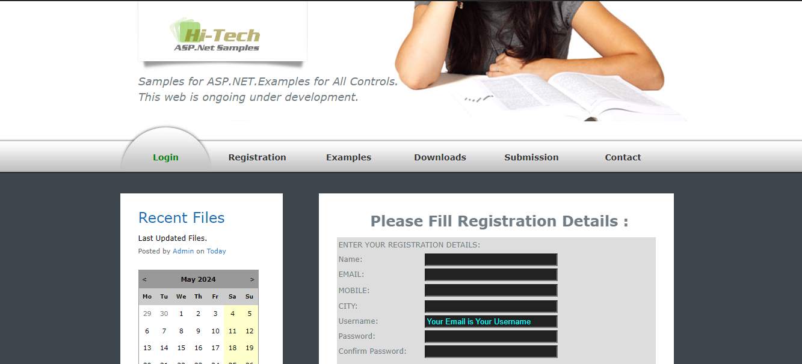
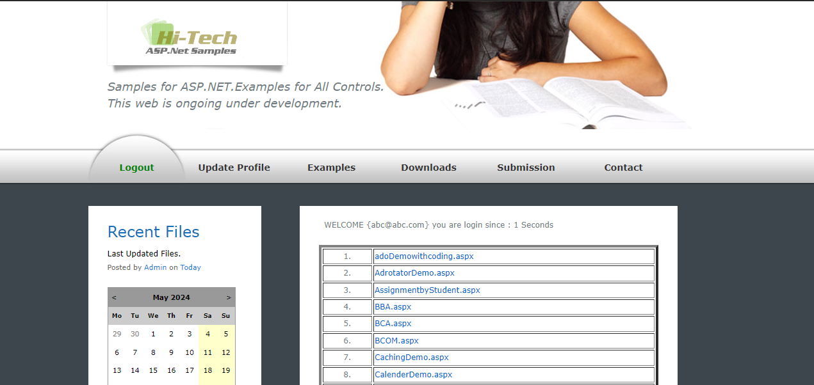

# AspDemoConnect

**AspDemoConnect** is a comprehensive web application developed in ASP.NET C# for educational institutions. It allows students to register, log in, view tutorials and live demos, upload their own demos, and submit assignments for different subjects. The site also silently tracks attendance using session data, providing a seamless learning and tracking experience.

## Features

- **User Registration and Login**: Secure and easy student registration and authentication.
- **View Tutorials**: Access educational tutorials anytime.
- **Live Demos**: Participate in live demos during lab hours via LAN.
- **Demo Upload**: Students can upload their own demos for review.
- **Assignment Upload**: Students can submit assignments for different subjects.
- **Attendance Tracking**: Silent attendance tracking through session data.
- **User-Friendly Interface**: Simple and intuitive design for ease of use.

## Screenshots


*Home Page*


*Tutorial Page*

## Technologies Used

- **Frontend**: HTML, CSS, JavaScript
- **Backend**: ASP.NET C#
- **Database**: SQL Server
- **Version Control**: Git

## Installation

1. Clone the repository:
    ```bash
    git clone https://github.com/contact2hitech/AspDemoConnect.git
    ```
2. Open the solution in Visual Studio.
3. Configure the SQL Server connection string in `appsettings.json`.
4. Apply migrations to set up the database.
    ```bash
    Update-Database
    ```
5. Run the application:
    ```bash
    dotnet run
    ```

## Usage

1. Register a new account or log in with existing credentials.
2. Navigate through the dashboard to access tutorials, live demos, and the demo upload section.
3. Submit assignments for different subjects through the assignment upload section.
4. Track your attendance and performance metrics silently through the session data.

## Contributing

We welcome contributions to **AspDemoConnect**! Here’s how you can help:

1. Fork the repository.
2. Create a new branch:
    ```bash
    git checkout -b feature-branch
    ```
3. Make your changes and commit them:
    ```bash
    git commit -m "Your detailed description of the changes."
    ```
4. Push to the branch:
    ```bash
    git push origin feature-branch
    ```
5. Create a pull request detailing your changes.

## License

This project is licensed under the MIT License. See the [LICENSE](LICENSE) file for more details.

## Contact

For any questions or feedback, please reach out at:
- **Email**: contact2hitech@gmail.com
- **GitHub**: [contact2hitech](https://github.com/contact2hitech)
